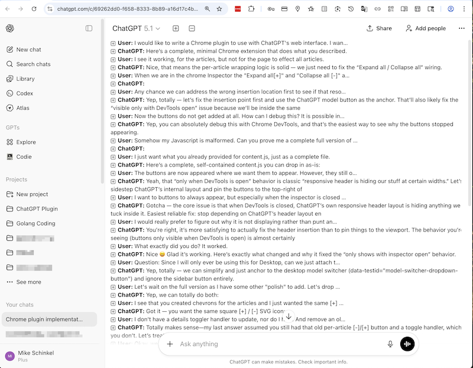
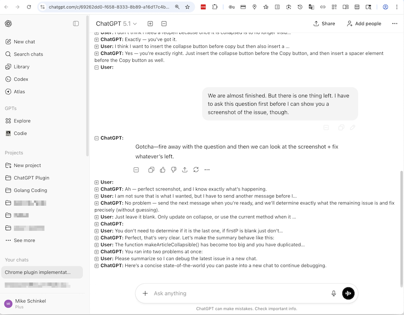

# ChatGPT Focus Mode — Collapse and Expand Chats

A clean, lightweight Chrome extension that lets you collapse and expand ChatGPT messages with smart, readable summaries.  
Built to reduce scrolling fatigue, improve navigation, and help you stay focused during long ChatGPT sessions.

## Collapsed

## Expanded


## Features

- **Collapse individual ChatGPT or user messages** with a click.
- **Smart automatic summaries** based on the first meaningful paragraph.
- **Ignores ChatGPT hidden/thinking content** so summaries stay clean.
- **Recomputes summaries when needed** (e.g., if collapsed before the final answer finishes streaming).
- **Top and bottom controls** for faster navigation through long threads.
- **Minimal, unobtrusive styling** that keeps the original ChatGPT look.
- **Zero dependencies** — pure DOM logic and CSS.

## Why “Focus Mode”?

Existing “collapser” extensions often capture:

- Hidden UI/accessibility labels like “ChatGPT said”
- Internal “thinking”/streaming content
- Partial or empty fragments of replies

**ChatGPT Focus Mode** fixes these issues with:

- Robust DOM scanning
- Intelligent filtering of hidden/thinking elements
- Accurate extraction of the real first paragraph only
- Resilient behavior during streaming or after DOM updates

The result: a cleaner, saner way to browse ChatGPT conversations.

## Installation (Developer Mode)

1. Download or clone the repository:
   ```bash
   git clone https://github.com/<your-user>/<your-repo>.git
   ```

2. Open Chrome and visit:
   ```
   chrome://extensions/
   ```
3. Toggle **Developer mode** on in the top-right.
4. Click **Load unpacked**.
5. Select the folder containing:

    * `manifest.json`
    * `content.js`
    * `styles.css`
    * `icons/` (optional, if added)

The extension will load and activate immediately.

## Usage

* Each message in a ChatGPT conversation becomes collapsible.
* Click the summary bar (“User:” or “ChatGPT:”) to toggle.
* When collapsed:

    * A short summary shows the first meaningful paragraph.
* When expanded:

    * The full message content is restored.
* Use the bottom “collapse message” button inside each toolbar for fast downward navigation.

## How It Works

* A `MutationObserver` tracks new ChatGPT messages as they appear.
* Each message (`<article>`) is wrapped in a `<details>` element.
* A summary bar is generated containing:

    * A label (“User:” / “ChatGPT:”)
    * A dynamic plus/minus icon
    * A smart snippet extracted from visible message content
* Hidden, streaming, and screen-reader-only elements are excluded.
* Toggling updates both the icon and the snippet display.

All logic runs locally in your browser.
No data is collected, stored, or transmitted.

## Development

To modify or extend:

1. Edit `content.js` or `styles.css`.
2. Go to `chrome://extensions/`.
3. Click **Reload** on the extension.
4. Refresh your ChatGPT tab.

### File Overview

* **manifest.json** — Chrome extension definition (Manifest V3)
* **content.js** — DOM manipulation, summary generation, toggle logic
* **styles.css** — Styling for summary bars and icons

## Known Limitations

* Some ChatGPT UI changes may require updating selectors for summary extraction.
* On extremely long sessions, Chrome may recycle DOM nodes; refreshing restores functionality.

## Contributing

Pull requests, issues, and feature requests are welcome.
Feel free to adapt or extend the logic for your own workflows.

## License

MIT License — free for personal and commercial use.
